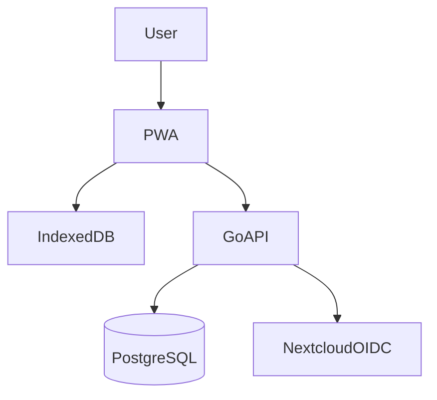

# Архитектура Sklad WMS

## Обзор

Модульный монолит: один Go API + PostgreSQL + offline-first PWA.



## Backend-модули

| Модуль | Назначение |
|--------|------------|
| catalog | SKU, категории, barcode |
| topology | Склады и места хранения |
| lots | Партии, сроки годности |
| movements | Операции по остаткам, журнал |
| stockview | Read-модель остатков |
| sync | Offline push/pull, идемпотентность |
| auth | OIDC + dev bypass |

## Clean Architecture (упрощённая)

```
internal/modules/<name>/
  domain/       entities, value objects, rules
  application/  use cases, ports
  infrastructure/  postgres repos, HTTP handlers
```

## Консистентность остатков

- `stock_movements` — immutable журнал
- `stock_balances` — материализованный агрегат
- Обновление в одной транзакции (см. ADR-006)

## Offline sync

1. Клиент пишет в IndexedDB + op_queue
2. Push батчей на `/api/v1/sync/push`
3. Pull изменений по курсору `/api/v1/sync/pull`
4. Идемпотентность по `(device_id, operation_key)`

## ADR

См. [docs/adr](../adr/).
